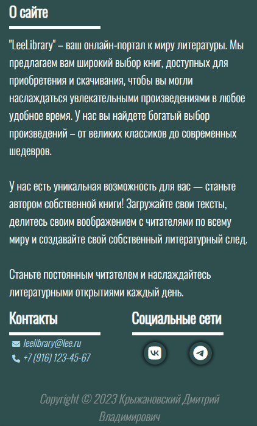

# Курсовая работа: Клиентская часть интернет-ресурса "Электронная библиотека"

## Описание проекта

Этот проект представляет собой веб-сайт, созданный в рамках курсовой работы. Сайт разработан с использованием HTML, CSS и JavaScript.

## Основные функции

1. **Главная страница:** Основная страница с баннерами и слайдерами "Рекомендуемое" и "Новинки".

  

    
  

  

    
  

2. **Каталог:** Страница со списком книг выбранного жанра.

  

    
  

  

    
  

3. **Информация о книге:** Полная информация о книге на отдельной странице.

  

    
  

  

    
  

4. **Отложенное:** Динамический список книг, которые пользователь отметил с помощью соответствующей кнопки.

  

    
  

  

    
  

5. **Корзина:** Динамический список книг, которые пользователь отметил с помощью соответствующей кнопки.

  

    
  

  

    
  

6. **Профиль:** Страница с информацией о пользователе.

  

    
  

  

    
  

7. **Footer**

  

    
  

  

    
  

## Технологии

- **HTML:** Используется для структуры веб-страниц.

- **CSS:** Применяется для стилизации и создания привлекательного внешнего вида.

- **JavaScript:** Добавляет интерактивность, включая реализацию слайдера, меню для мобильных устройств и возможности добавления в корзину.
